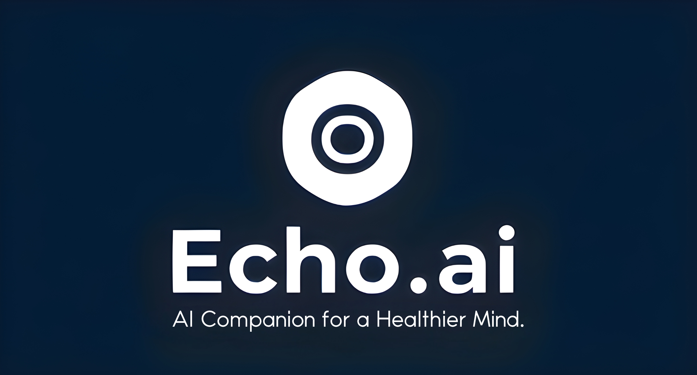

# Echo.ai

🧠 *AI Companion for a Healthier Mind*



## Overview
Echo.ai is an AI-powered mental health companion designed to provide supportive, non-judgmental guidance using **Gemini AI**. It helps users manage stress, anxiety, and mental well-being with thoughtful conversations and scientifically-backed techniques.

---

## Features
✅ AI-driven mental health support  
✅ Mindfulness, Empathetic and non-judgmental responses  
✅ Secure and private conversations  
---

## **Tech Stack**  
### **Frontend (Client)**  
- React.js (Vite)   
- Tailwind CSS     

### **Backend (Server)**  
- Node.js   
- Express.js   
- MongoDB  
- Gemini AI API   

---  

## **Project Structure**  
```
/Echo.ai
│── /client  
│   ├── package.json  
│── /backend  
│   ├── package.json  
│── .gitignore  
│── README.md  
```

---  

## **Installation & Setup**  
### **1. Clone the Repository**  
```sh
git clone https://github.com/ParthGorde/Echo.ai.git
cd Echo.ai
```

### **2. Set Up Backend**  
```sh
cd backend
npm install
cp .env.backend .env  # Add API keys here
npm start
```

### **3. Set Up Frontend**  
```sh
cd ../client
npm install
cp .env.client .env  # Add API keys here
npm run dev
```

---  

## **Usage**  
1. Open **http://localhost:5173/** (if using Vite).   
2. Chat with Echo.ai for guidance on mental well-being.   
3. Backend API runs on **http://localhost:5000/**.   

---  

## **Contributing**  
We welcome contributions! Feel free to:   
- Report bugs 🐞   
- Suggest features ✨   
- Improve UI/UX 🎨   

---  

## **Coming Soon 🚀**  

Stay tuned for updates! 🎉

